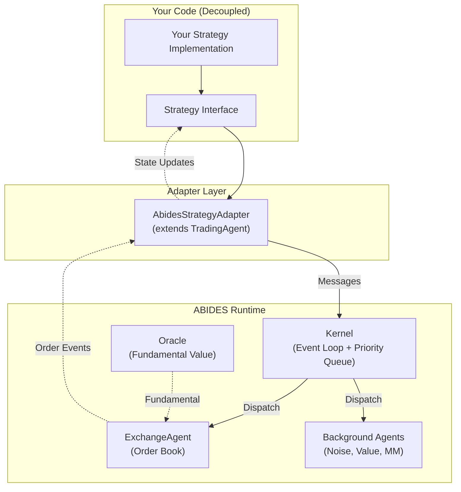
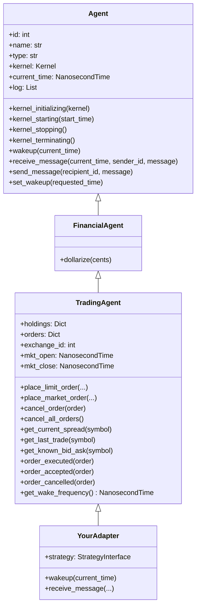
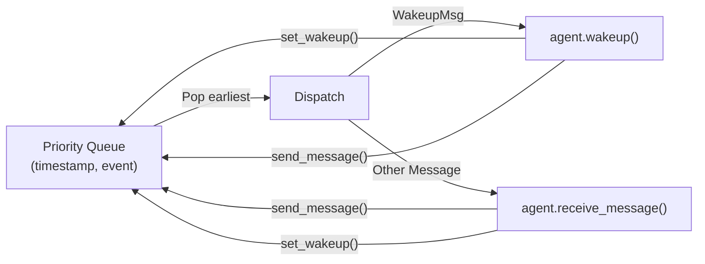

# ABIDES Custom Agent Implementation Guide

## Decoupling Interface & Adapter Pattern for Custom Trading Strategies

---

## Table of Contents

1. [Architecture Overview](#1-architecture-overview)
2. [ABIDES Internals — What You Need to Know](#2-abides-internals--what-you-need-to-know)
3. [Class Hierarchy & Inheritance Map](#3-class-hierarchy--inheritance-map)
4. [Agent Lifecycle — The 6 Phases](#4-agent-lifecycle--the-6-phases)
5. [The Kernel Event Loop — How Time Works](#5-the-kernel-event-loop--how-time-works)
6. [Message Protocol & Order Flow](#6-message-protocol--order-flow)
7. [State Inference — The Logging Trap](#7-state-inference--the-logging-trap)
8. [Decoupling Interface Design](#8-decoupling-interface-design)
9. [Adapter Class — Bridging Into ABIDES](#9-adapter-class--bridging-into-abides)
10. [Config Integration — Injecting Your Agent](#10-config-integration--injecting-your-agent)
11. [Extracting Results After Simulation](#11-extracting-results-after-simulation)
12. [Gotchas & Pitfalls](#12-gotchas--pitfalls)
13. [Quick-Start Recipes](#13-quick-start-recipes)
14. [Custom Oracle — Injecting Historical Data](#14-custom-oracle--injecting-historical-data)

---

## 1. Architecture Overview

ABIDES is a **discrete-event, message-passing simulation** framework. It is *not* a traditional loop-based simulator — time advances by jumping to the next event in a priority queue. This has profound implications for how you design agents.



**Key principle**: Your strategy code should know *nothing* about ABIDES internals. The adapter translates between your clean API and ABIDES's message-based event system.

---

## 2. ABIDES Internals — What You Need to Know

### 2.1 Time Representation

All time in ABIDES is in **nanoseconds** (`NanosecondTime = int`). There are no `datetime` objects inside the simulation — only `int` values representing nanoseconds since epoch.

```python
# Converting human-readable to nanoseconds
from abides_core.utils import str_to_ns
one_second = str_to_ns("1s")      # 1_000_000_000
market_open = str_to_ns("09:30:00")  # nanoseconds from midnight
```

### 2.2 Prices

All prices are in **integer cents** (1 dollar = 100). A stock at $1,000.00 has `price = 100_000`. This avoids floating-point issues in financial calculations.

### 2.3 Cash & Holdings

Cash is tracked as integer cents in `self.holdings["CASH"]`. Share positions are tracked as integers in `self.holdings["SYMBOL"]`.

### 2.4 The Oracle

The oracle provides the "true" fundamental value of assets. Background agents use it to inform their beliefs. Your custom agent may or may not use it — accessing it via `self.kernel.oracle` is available but optional.

---

## 3. Class Hierarchy & Inheritance Map



> [!IMPORTANT]
> **Always extend `TradingAgent`**, not `Agent` or `FinancialAgent`. `TradingAgent` handles exchange discovery, market hours, order lifecycle, portfolio tracking, and bid/ask caching. If you skip it, you must reimplement ~1,200 lines of plumbing.

---

## 4. Agent Lifecycle — The 6 Phases

Every agent in ABIDES goes through a strict lifecycle managed by the Kernel:

```
┌─────────────────────────────────────────────────────────────────┐
│ Phase 1: kernel_initializing(kernel)                            │
│   • Kernel reference stored (self.kernel = kernel)              │
│   • No other agents guaranteed to exist yet                     │
│   • DO NOT send messages here                                   │
├─────────────────────────────────────────────────────────────────┤
│ Phase 2: kernel_starting(start_time)                            │
│   • All agents exist now                                        │
│   • TradingAgent discovers ExchangeAgent via                    │
│     kernel.find_agents_by_type(ExchangeAgent)                   │
│   • First wakeup scheduled via set_wakeup(start_time)           │
│   • Override get_wake_frequency() to control first-wake delay   │
├─────────────────────────────────────────────────────────────────┤
│ Phase 3: wakeup(current_time) — MAIN STRATEGY ENTRY POINT      │
│   • Called when your scheduled alarm fires                      │
│   • First wakeup: TradingAgent requests market hours            │
│   • Subsequent wakeups: your strategy logic runs here           │
│   • MUST call super().wakeup(current_time) first                │
│   • Schedule next wakeup with self.set_wakeup(next_time)        │
├─────────────────────────────────────────────────────────────────┤
│ Phase 4: receive_message(current_time, sender_id, message)      │
│   • Called when incoming messages arrive (order fills, data, ..) │
│   • TradingAgent routes messages to typed handlers              │
│   • Override order_executed(), query_spread(), etc.              │
│   • MUST call super().receive_message(...) first                 │
├─────────────────────────────────────────────────────────────────┤
│ Phase 5: kernel_stopping()                                      │
│   • All agents still exist                                      │
│   • TradingAgent logs final holdings, marks to market            │
│   • Good place to compute your strategy metrics                 │
├─────────────────────────────────────────────────────────────────┤
│ Phase 6: kernel_terminating()                                   │
│   • Agent logs written to disk                                  │
│   • No other agents guaranteed to exist                         │
│   • DO NOT send messages here                                   │
└─────────────────────────────────────────────────────────────────┘
```

> [!CAUTION]
> The very first `wakeup()` call does **not** mean the market is open. `TradingAgent.wakeup()` returns a boolean indicating trade-readiness. You must check `self.mkt_open` and `self.mkt_close` are set before trading. Market hours are received asynchronously via a message exchange in `receive_message`.

---

## 5. The Kernel Event Loop — How Time Works



**Critical details**:

1. **Time only advances** when the Kernel pops the next event. There is no "tick" — no `on_bar()` callback. You decide your own schedule via `set_wakeup()`.

2. **Computation delay**: After each wakeup/message, the agent's "local clock" advances by `computation_delay` nanoseconds. The agent **cannot act again** until the global clock catches up. This prevents infinite loops of simultaneous events.

3. **Latency**: Messages between agents are delayed by a latency model. Your order doesn't reach the Exchange instantly — it arrives after `latency + computation_delay` nanoseconds.

4. **No synchronous responses**: When you call `get_current_spread(symbol)`, a *request message* is sent to the Exchange. The response arrives asynchronously later as a `QuerySpreadResponseMsg` inside `receive_message()`. This is a fundamental architectural constraint.

---

## 6. Message Protocol & Order Flow

### 6.1 Placing an Order

```
Your Agent                    Kernel                     Exchange
    │                           │                           │
    ├── place_limit_order() ──► │                           │
    │   (creates LimitOrderMsg) │                           │
    │                           ├── deliver after latency ─►│
    │                           │                           ├── OrderAcceptedMsg
    │                           │◄──────────────────────────┤
    │◄── receive_message() ─────┤                           │
    │    (order_accepted)       │                           │
    │                           │                           │
    │                           │  ... time passes ...      │
    │                           │                           │
    │                           │                           ├── OrderExecutedMsg
    │                           │◄──────────────────────────┤  (partial or full fill)
    │◄── receive_message() ─────┤                           │
    │    (order_executed)       │                           │
```

### 6.2 Key Message Types

| Direction | Message | Purpose |
|-----------|---------|---------|
| Agent → Exchange | `LimitOrderMsg`, `MarketOrderMsg` | Place orders |
| Agent → Exchange | `CancelOrderMsg` | Cancel an open order |
| Agent → Exchange | `QuerySpreadMsg` | Request current bid/ask |
| Agent → Exchange | `QueryLastTradeMsg` | Request last trade price |
| Agent → Exchange | `MarketHoursRequestMsg` | Ask for open/close times |
| Agent → Exchange | `L2SubReqMsg` | Subscribe to L2 data feed |
| Exchange → Agent | `OrderAcceptedMsg` | Order entered the book |
| Exchange → Agent | `OrderExecutedMsg` | Order (partially) filled |
| Exchange → Agent | `OrderCancelledMsg` | Order cancelled |
| Exchange → Agent | `QuerySpreadResponseMsg` | Bid/ask response |
| Exchange → Agent | `MarketHoursMsg` | Open/close times |
| Exchange → Agent | `L2DataMsg` | L2 subscription update |
| Exchange → Agent | `MarketClosedMsg` | Market is closed |

### 6.3 Data You Can Access

| Source | Access Pattern | Timing |
|--------|---------------|--------|
| Current spread | `get_current_spread(symbol)` → async response in `receive_message` | On-demand |
| Last trade | `get_last_trade(symbol)` → async response | On-demand |
| L2 order book | Subscribe via `request_data_subscription(L2SubReqMsg(...))` | Periodic push |
| Holdings | `self.holdings` (dict) | Always available |
| Open orders | `self.orders` (dict of order_id → Order) | Always available |
| Cached bid/ask | `self.known_bids[symbol]`, `self.known_asks[symbol]` | After any spread query |
| Mark-to-market | `self.mark_to_market(self.holdings)` | Anytime after first trade |

---

## 7. State Inference — The Logging Trap

> [!WARNING]
> **Agent state is partially inferred from logs.** This is one of the most subtle aspects of ABIDES. The kernel and post-simulation analysis code extract metrics like PnL, trade count, and final valuations from the *event log* that agents maintain, not from explicit state queries.

Key log events recorded by `TradingAgent`:

| Event Type | When Logged | What It Contains |
|------------|-------------|-----------------|
| `STARTING_CASH` | `kernel_starting` | Initial cash (int cents) |
| `FINAL_CASH_POSITION` | `kernel_stopping` | Final cash position |
| `ENDING_CASH` | `kernel_stopping` | Mark-to-market value |
| `HOLDINGS_UPDATED` | After each fill | Full holdings dict |
| `ORDER_SUBMITTED` | When placing orders | Order dict |
| `ORDER_EXECUTED` | On fill notification | Order dict with fill_price |
| `ORDER_CANCELLED` | On cancel confirmation | Order dict |
| `MARK_TO_MARKET` | On M2M computation | Symbol × quantity × price |

**Implication for your adapter**: If you want post-simulation analysis tools to work, you must either:
1. Call `super()` methods faithfully so `TradingAgent` logs correctly, OR
2. Add your own log events via `self.logEvent("YOUR_EVENT", data)`.

---

## 8. Decoupling Interface Design

This is the **clean API** your strategy code implements. It knows nothing about ABIDES.

```python
"""strategy_interface.py — Pure strategy abstraction, zero ABIDES dependency."""

from abc import ABC, abstractmethod
from dataclasses import dataclass, field
from enum import Enum
from typing import Dict, List, Optional


class OrderSide(Enum):
    """Direction of a trade."""
    BUY = "BUY"
    SELL = "SELL"


class OrderType(Enum):
    """Type of order to place."""
    MARKET = "MARKET"
    LIMIT = "LIMIT"


@dataclass(frozen=True)
class MarketSnapshot:
    """
    Immutable snapshot of market state delivered to the strategy on each tick.
    All prices in integer cents. Time in nanoseconds.
    """
    timestamp: int                               # current simulation time (ns)
    symbol: str
    best_bid: Optional[int] = None               # best bid price (cents)
    best_ask: Optional[int] = None               # best ask price (cents)
    best_bid_size: int = 0
    best_ask_size: int = 0
    last_trade_price: Optional[int] = None
    bid_depth: List[tuple] = field(default_factory=list)  # [(price, qty), ...]
    ask_depth: List[tuple] = field(default_factory=list)
    mkt_open: Optional[int] = None               # market open time (ns)
    mkt_close: Optional[int] = None              # market close time (ns)


@dataclass(frozen=True)
class PortfolioState:
    """Current portfolio snapshot."""
    cash: int                                    # cents
    holdings: Dict[str, int]                     # symbol → shares
    open_orders: int                             # count of open orders
    starting_cash: int                           # initial capital (cents)
    mark_to_market: Optional[int] = None         # estimated total value


@dataclass
class StrategyOrder:
    """An order instruction emitted by the strategy."""
    symbol: str
    side: OrderSide
    quantity: int
    order_type: OrderType = OrderType.LIMIT
    limit_price: Optional[int] = None            # required if LIMIT
    tag: Optional[str] = None                    # free-form metadata


@dataclass(frozen=True)
class FillEvent:
    """Notification of an order execution."""
    symbol: str
    side: OrderSide
    quantity: int
    fill_price: int                              # cents
    order_id: int


class TradingStrategy(ABC):
    """
    Pure strategy interface. Implement this to define your trading logic.
    No ABIDES imports, no message handling, no kernel references.
    """

    @abstractmethod
    def on_trading_start(self, snapshot: MarketSnapshot, portfolio: PortfolioState) -> None:
        """Called once when the market opens and the agent is ready to trade."""
        ...

    @abstractmethod
    def on_tick(
        self,
        snapshot: MarketSnapshot,
        portfolio: PortfolioState,
    ) -> List[StrategyOrder]:
        """
        Called on each scheduled wakeup.

        Returns:
            A list of StrategyOrder objects to place. Return [] for no action.
        """
        ...

    @abstractmethod
    def on_fill(self, fill: FillEvent, portfolio: PortfolioState) -> List[StrategyOrder]:
        """
        Called when an order is filled (partially or fully).

        Returns:
            A list of follow-up StrategyOrder objects. Return [] for no action.
        """
        ...

    def on_market_data(self, snapshot: MarketSnapshot, portfolio: PortfolioState) -> List[StrategyOrder]:
        """
        Called when a market data subscription update arrives.
        Default: no action. Override to react to data pushes.
        """
        return []

    def on_trading_end(self, portfolio: PortfolioState) -> None:
        """Called when the market closes. Use for final reporting."""
        ...

    @abstractmethod
    def get_wakeup_interval_ns(self) -> int:
        """
        Return the desired interval between wakeups in nanoseconds.
        E.g. 60_000_000_000 for one wakeup per minute.
        """
        ...

    def should_cancel_on_tick(self) -> bool:
        """
        If True, all open orders are cancelled before each on_tick call.
        Override to return False if you want to manage cancellations manually.
        """
        return True
```

### Design Rationale

| Decision | Why |
|----------|-----|
| `frozen=True` dataclasses | Strategies can't accidentally mutate state |
| Prices in *integer cents* | Match ABIDES internal representation without conversion |
| `on_tick` returns orders | Pull-based model, strategy remains in control |
| `on_fill` also returns orders | Enables reactive strategies (e.g., re-hedge on fill) |
| `get_wakeup_interval_ns` | Strategy controls its own frequency |
| `should_cancel_on_tick` | Simplifies the common "cancel-and-replace" pattern |

---

## 9. Adapter Class — Bridging Into ABIDES

```python
"""abides_adapter.py — Bridges the TradingStrategy interface into ABIDES."""

import logging
from typing import List, Optional

import numpy as np
from abides_core import Message, NanosecondTime
from abides_markets.agents.trading_agent import TradingAgent
from abides_markets.messages.marketdata import L2DataMsg, L2SubReqMsg, MarketDataMsg
from abides_markets.messages.query import QuerySpreadResponseMsg
from abides_markets.orders import Side

from .strategy_interface import (
    FillEvent,
    MarketSnapshot,
    OrderSide,
    OrderType,
    PortfolioState,
    StrategyOrder,
    TradingStrategy,
)

logger = logging.getLogger(__name__)


class AbidesStrategyAdapter(TradingAgent):
    """
    ABIDES agent that delegates all trading decisions to a TradingStrategy.

    This class handles:
    - ABIDES lifecycle (kernel init, start, stop, terminate)
    - Message routing and async state management
    - Translation between ABIDES message types and strategy data classes
    - Wakeup scheduling based on strategy frequency

    The strategy implementation remains completely decoupled from ABIDES.
    """

    def __init__(
        self,
        id: int,
        strategy: TradingStrategy,
        symbol: str = "ABM",
        starting_cash: int = 10_000_000,
        name: Optional[str] = None,
        type: Optional[str] = None,
        random_state: Optional[np.random.RandomState] = None,
        log_orders: bool = True,
        subscribe_to_l2: bool = True,
        l2_depth: int = 10,
        l2_freq_ns: int = int(1e8),  # 100ms
    ) -> None:
        super().__init__(
            id=id,
            name=name or f"StrategyAgent_{id}",
            type=type or "CustomStrategy",
            random_state=random_state,
            starting_cash=starting_cash,
            log_orders=log_orders,
        )
        self.strategy = strategy
        self.symbol = symbol
        self._trading_started = False
        self._subscribe_to_l2 = subscribe_to_l2
        self._l2_depth = l2_depth
        self._l2_freq_ns = l2_freq_ns
        self._has_subscribed = False

    # ── Lifecycle ──────────────────────────────────────────────────

    def kernel_starting(self, start_time: NanosecondTime) -> None:
        super().kernel_starting(start_time)

    def kernel_stopping(self) -> None:
        # Notify strategy of trading end before TradingAgent logs final state
        portfolio = self._build_portfolio_state()
        self.strategy.on_trading_end(portfolio)
        super().kernel_stopping()

    # ── Wakeup Logic ──────────────────────────────────────────────

    def get_wake_frequency(self) -> NanosecondTime:
        """Controls the delay from market open to first wakeup."""
        return self.strategy.get_wakeup_interval_ns()

    def wakeup(self, current_time: NanosecondTime) -> None:
        # Let TradingAgent handle market hours discovery
        can_trade = super().wakeup(current_time)

        if not can_trade:
            return

        # Subscribe to L2 data on first tradeable wakeup
        if self._subscribe_to_l2 and not self._has_subscribed:
            self.request_data_subscription(
                L2SubReqMsg(
                    symbol=self.symbol,
                    freq=self._l2_freq_ns,
                    depth=self._l2_depth,
                )
            )
            self._has_subscribed = True

        # Notify strategy of trading start (once)
        if not self._trading_started:
            self._trading_started = True
            snapshot = self._build_market_snapshot()
            portfolio = self._build_portfolio_state()
            self.strategy.on_trading_start(snapshot, portfolio)

        # Build state and ask strategy for decisions
        snapshot = self._build_market_snapshot()
        portfolio = self._build_portfolio_state()

        # Cancel-and-replace pattern
        if self.strategy.should_cancel_on_tick():
            self.cancel_all_orders()

        orders = self.strategy.on_tick(snapshot, portfolio)
        self._execute_orders(orders)

        # Schedule next wakeup
        next_wake = current_time + self.strategy.get_wakeup_interval_ns()
        if self.mkt_close and next_wake < self.mkt_close:
            self.set_wakeup(next_wake)

    # ── Message Handling ──────────────────────────────────────────

    def receive_message(
        self, current_time: NanosecondTime, sender_id: int, message: Message
    ) -> None:
        # TradingAgent handles all standard message routing
        super().receive_message(current_time, sender_id, message)

        # React to market data subscription updates
        if isinstance(message, MarketDataMsg) and self._trading_started:
            snapshot = self._build_market_snapshot()
            portfolio = self._build_portfolio_state()
            orders = self.strategy.on_market_data(snapshot, portfolio)
            self._execute_orders(orders)

    def order_executed(self, order) -> None:
        """Override to notify strategy of fills."""
        super().order_executed(order)

        if not self._trading_started:
            return

        side = OrderSide.BUY if order.side.is_bid() else OrderSide.SELL
        fill = FillEvent(
            symbol=order.symbol,
            side=side,
            quantity=order.quantity,
            fill_price=order.fill_price,
            order_id=order.order_id,
        )
        portfolio = self._build_portfolio_state()
        follow_up_orders = self.strategy.on_fill(fill, portfolio)
        self._execute_orders(follow_up_orders)

    # ── State Builders ────────────────────────────────────────────

    def _build_market_snapshot(self) -> MarketSnapshot:
        """Builds a MarketSnapshot from ABIDES cached state."""
        bids = self.known_bids.get(self.symbol, [])
        asks = self.known_asks.get(self.symbol, [])
        last = self.last_trade.get(self.symbol)

        return MarketSnapshot(
            timestamp=self.current_time,
            symbol=self.symbol,
            best_bid=bids[0][0] if bids else None,
            best_ask=asks[0][0] if asks else None,
            best_bid_size=bids[0][1] if bids else 0,
            best_ask_size=asks[0][1] if asks else 0,
            last_trade_price=last,
            bid_depth=list(bids),
            ask_depth=list(asks),
            mkt_open=self.mkt_open,
            mkt_close=self.mkt_close,
        )

    def _build_portfolio_state(self) -> PortfolioState:
        """Builds a PortfolioState from TradingAgent state."""
        m2m = None
        try:
            if self.last_trade.get(self.symbol) is not None:
                m2m = self.mark_to_market(self.holdings)
        except Exception:
            pass

        return PortfolioState(
            cash=self.holdings.get("CASH", 0),
            holdings={k: v for k, v in self.holdings.items() if k != "CASH"},
            open_orders=len(self.orders),
            starting_cash=self.starting_cash,
            mark_to_market=m2m,
        )

    # ── Order Execution ───────────────────────────────────────────

    def _execute_orders(self, orders: List[StrategyOrder]) -> None:
        """Translates StrategyOrders into ABIDES order calls."""
        for order in orders:
            side = Side.BID if order.side == OrderSide.BUY else Side.ASK

            if order.order_type == OrderType.MARKET:
                self.place_market_order(
                    symbol=order.symbol,
                    quantity=order.quantity,
                    side=side,
                    tag=order.tag,
                )
            elif order.order_type == OrderType.LIMIT:
                if order.limit_price is None:
                    logger.warning(
                        "Limit order without price ignored: %s", order
                    )
                    continue
                self.place_limit_order(
                    symbol=order.symbol,
                    quantity=order.quantity,
                    side=side,
                    limit_price=order.limit_price,
                    tag=order.tag,
                )
```

---

## 10. Config Integration — Injecting Your Agent

ABIDES simulations are configured via Python functions that return a config dictionary. To inject your custom agent, you add it to the agent list. Below is the minimal pattern:

```python
"""my_simulation.py — Running a simulation with your custom agent."""

import numpy as np
from abides_core import abides
from abides_markets.configs.rmsc04 import build_config

from my_package.strategy_interface import (
    TradingStrategy, MarketSnapshot, PortfolioState,
    StrategyOrder, FillEvent, OrderSide, OrderType,
)
from my_package.abides_adapter import AbidesStrategyAdapter


# ── Step 1: Implement your strategy ──────────────────────────────

class SimpleSpreadStrategy(TradingStrategy):
    """Example: place limit orders around the midpoint."""

    def on_trading_start(self, snapshot, portfolio):
        pass  # One-time setup if needed

    def on_tick(self, snapshot: MarketSnapshot, portfolio: PortfolioState):
        if snapshot.best_bid is None or snapshot.best_ask is None:
            return []

        mid = (snapshot.best_bid + snapshot.best_ask) // 2
        spread_offset = 50  # 50 cents = $0.50

        return [
            StrategyOrder(
                symbol=snapshot.symbol,
                side=OrderSide.BUY,
                quantity=10,
                order_type=OrderType.LIMIT,
                limit_price=mid - spread_offset,
            ),
            StrategyOrder(
                symbol=snapshot.symbol,
                side=OrderSide.SELL,
                quantity=10,
                order_type=OrderType.LIMIT,
                limit_price=mid + spread_offset,
            ),
        ]

    def on_fill(self, fill: FillEvent, portfolio: PortfolioState):
        return []  # No reactive orders

    def on_trading_end(self, portfolio: PortfolioState):
        pnl = portfolio.cash - portfolio.starting_cash
        print(f"Strategy PnL: ${pnl / 100:.2f}")

    def get_wakeup_interval_ns(self):
        return 30_000_000_000  # 30 seconds


# ── Step 2: Build config and inject adapter ──────────────────────

def run_simulation(seed: int = 42):
    # Build the standard background agent config
    config = build_config(seed=seed, end_time="11:00:00")

    # Create master RNG for reproducibility
    master_rng = np.random.RandomState(seed)

    # Create your strategy and wrap it in the adapter
    strategy = SimpleSpreadStrategy()

    # The adapter needs a unique agent ID (append after all other agents)
    next_id = len(config["agents"])

    adapter_agent = AbidesStrategyAdapter(
        id=next_id,
        strategy=strategy,
        symbol="ABM",
        starting_cash=10_000_000,
        name="MyCustomStrategy",
        random_state=np.random.RandomState(
            seed=master_rng.randint(low=0, high=2**32, dtype="uint64")
        ),
        log_orders=True,
    )

    # Inject into the agent list
    config["agents"].append(adapter_agent)

    # Run the simulation
    end_state = abides.run(config)

    # Extract your agent from results
    agents = end_state["agents"]
    my_agent = agents[next_id]
    print(f"Final holdings: {my_agent.holdings}")

    return end_state


if __name__ == "__main__":
    run_simulation()
```

> [!NOTE]
> **Agent ID must be unique and sequential.** ABIDES uses agent IDs as indices into arrays (`agent_current_times`, `agent_computation_delays`, `agent_latency`). Your agent's `id` must equal its position in the `agents` list. Use `len(config["agents"])` before appending.

> [!WARNING]
> **The latency model may need resizing.** The `build_config` functions create a latency model sized for their agent count. When appending a new agent, ensure the latency model covers the new agent count. The simplest fix: rebuild the latency model after appending, or use the default scalar latency. See below:

```python
from abides_markets.utils import generate_latency_model

# After appending your agent:
new_count = len(config["agents"])
latency_rng = np.random.RandomState(seed=seed + 1)
config["agent_latency_model"] = generate_latency_model(new_count, latency_rng)
```

---

## 11. Extracting Results After Simulation

The simulation returns an `end_state` dictionary with all agents and kernel state:

```python
end_state = abides.run(config)

# Access all agents
agents = end_state["agents"]

# Your adapter agent (by index)
my_agent = agents[your_agent_id]

# Portfolio metrics (from TradingAgent)
print(f"Final cash: ${my_agent.holdings['CASH'] / 100:.2f}")
print(f"Share position: {my_agent.holdings.get('ABM', 0)}")

# Event log (list of (timestamp, event_type, event_data) tuples)
for timestamp, event_type, event_data in my_agent.log[-10:]:
    print(f"  {event_type}: {event_data}")

# Exchange agent order book data
exchange = agents[0]

# Summary log from kernel
# Written to log/<log_dir>/summary_log.bz2 if skip_log=False
```

---

## 12. Gotchas & Pitfalls

### 12.1 The Async Mind Shift

**Nothing is synchronous.** When you call `self.get_current_spread(symbol)`, the data arrives *later* in `receive_message()`. You cannot do:

```python
# ❌ WRONG — This does not work
self.get_current_spread("ABM")
bid = self.known_bids["ABM"][0][0]  # May be stale or crash
```

Instead, use the **state machine pattern** (as done by `ValueAgent` and `NoiseAgent`):

```python
# ✅ Correct — Request data, then act on receipt
def wakeup(self, current_time):
    super().wakeup(current_time)
    self.get_current_spread(self.symbol)
    self.state = "AWAITING_SPREAD"

def receive_message(self, current_time, sender_id, message):
    super().receive_message(current_time, sender_id, message)
    if self.state == "AWAITING_SPREAD" and isinstance(message, QuerySpreadResponseMsg):
        # NOW self.known_bids and self.known_asks are fresh
        self.place_orders()
        self.state = "AWAITING_WAKEUP"
```

**Our adapter avoids this** by:
- Subscribing to L2 data (push-based, always fresh).
- Using `known_bids`/`known_asks` caches populated by subscription updates.
- The first few ticks may have `None` bid/ask values — strategy must handle this.

### 12.2 Random State Requirements

Every agent **must** have a `random_state` parameter (a `np.random.RandomState` instance). The base `Agent.__init__` will raise `ValueError` if it's `None`. Always create one from a seeded RNG for reproducibility.

### 12.3 Order ID Collisions

ABIDES uses a global `Order._order_id_counter`. Across agents, order IDs are unique. Don't manually set `order_id` unless implementing a replay scenario.

### 12.4 Cash is Always Cents

`$100.00` = `10_000` cents. `$1,000.00` = `100_000` cents. Forgetting this will produce wildly incorrect PnL.

### 12.5 Computation Delay

The default `computation_delay` is typically 1–50 nanoseconds. This is the time an agent is "busy" after each event. If your strategy needs to send multiple messages in one wake cycle, they all get sent at `current_time + computation_delay`. Use `self.delay(additional_ns)` to stagger them.

### 12.6 Log Events for Post-Analysis

If you want custom metrics in the summary log, use:

```python
self.logEvent("MY_SIGNAL", signal_value, append_summary_log=True)
```

The `append_summary_log=True` flag makes it available in the global summary log, not just the per-agent log.

---

## 13. Quick-Start Recipes

### 13.1 Strategy That Trades Once Per Minute

```python
class MinuteTrader(TradingStrategy):
    def get_wakeup_interval_ns(self):
        return 60_000_000_000  # 1 minute

    def on_tick(self, snapshot, portfolio):
        if snapshot.best_ask and portfolio.holdings.get(snapshot.symbol, 0) == 0:
            return [StrategyOrder(
                symbol=snapshot.symbol,
                side=OrderSide.BUY,
                quantity=100,
                order_type=OrderType.MARKET,
            )]
        return []

    # ... implement remaining abstract methods
```

### 13.2 Strategy Using L2 Depth

```python
def on_market_data(self, snapshot, portfolio):
    """React to every L2 update."""
    if len(snapshot.bid_depth) >= 3 and len(snapshot.ask_depth) >= 3:
        # Sum volume at top 3 bid levels
        bid_vol = sum(qty for _, qty in snapshot.bid_depth[:3])
        ask_vol = sum(qty for _, qty in snapshot.ask_depth[:3])

        if bid_vol > 2 * ask_vol:
            # Heavy bid imbalance → buy signal
            return [StrategyOrder(
                symbol=snapshot.symbol,
                side=OrderSide.BUY,
                quantity=10,
                order_type=OrderType.MARKET,
            )]
    return []
```

### 13.3 Extending the Adapter

If you need additional ABIDES functionality (e.g., oracle access, custom log events), subclass the adapter:

```python
class ExtendedAdapter(AbidesStrategyAdapter):
    def kernel_starting(self, start_time):
        super().kernel_starting(start_time)
        # Access oracle fundamental value
        self.oracle = self.kernel.oracle

    def wakeup(self, current_time):
        super().wakeup(current_time)
        # Log custom metric
        self.logEvent("FUNDAMENTAL_VALUE",
                      self.oracle.observe_price(self.symbol, self.current_time,
                                                 sigma_n=0,
                                                 random_state=self.random_state))
```

---

## 14. Custom Oracle — Injecting Historical Data

ABIDES ships with synthetic oracles (`MeanRevertingOracle`, `SparseMeanRevertingOracle`) that generate fundamental values algorithmically. For backtesting against real data — or data from generative models like CGANs — use the `ExternalDataOracle`.

### 14.1 Architecture

```
┌─────────────────────────────────────────┐
│  Your Project                           │
│                                         │
│  DatabaseProvider ──┐                   │
│  CGANProvider    ───┤ implements        │
│  CsvProvider     ───┘ Protocol          │
└──────────────────────┬──────────────────┘
                       │ passes provider
                       ▼
┌─────────────────────────────────────────┐
│  abides-markets (this library)          │
│                                         │
│  BatchDataProvider (Protocol)           │
│  PointDataProvider (Protocol)           │
│       ↓ used by                         │
│  ExternalDataOracle(Oracle)             │
└─────────────────────────────────────────┘
```

Two provider protocols serve different use cases:

| Provider | Returns | Memory | Best For |
|----------|---------|--------|----------|
| `BatchDataProvider` | Full `pd.Series` | O(n) — entire series | Files, pre-computed data, small datasets |
| `PointDataProvider` | Single `int` per call | O(cache_size) — bounded | Databases, CGAN generators, large datasets |

### 14.2 Batch Mode — From a DataFrame

The simplest path. Pass pre-loaded data directly:

```python
import pandas as pd
from abides_markets.oracles import ExternalDataOracle

# Your data: DatetimeIndex, integer cents
data = {"AAPL": my_price_series}

oracle = ExternalDataOracle(
    mkt_open=mkt_open,
    mkt_close=mkt_close,
    symbols=["AAPL"],
    data=data,
)
```

Or use the built-in `DataFrameProvider`:

```python
from abides_markets.oracles import DataFrameProvider, ExternalDataOracle

provider = DataFrameProvider({"AAPL": my_series, "GOOG": another_series})
oracle = ExternalDataOracle(
    mkt_open, mkt_close, ["AAPL", "GOOG"], provider=provider
)
```

### 14.3 Point Mode — From a Database or Generator

For large datasets or on-demand generation, implement `PointDataProvider`:

```python
class DatabaseProvider:
    """Your project implements this — no ABIDES import needed."""

    def __init__(self, connection):
        self._conn = connection

    def get_fundamental_at(self, symbol: str, timestamp: int) -> int:
        row = self._conn.execute(
            "SELECT price_cents FROM fundamentals "
            "WHERE symbol=? AND ts<=? ORDER BY ts DESC LIMIT 1",
            (symbol, timestamp),
        ).fetchone()
        return int(row[0])

# Usage
oracle = ExternalDataOracle(
    mkt_open, mkt_close, ["AAPL"],
    provider=DatabaseProvider(my_conn),
    cache_size=10_000,  # LRU cache bounds memory
)
```

### 14.4 Interpolation Strategies

When agent queries don't land exactly on a data point (batch mode only):

```python
from abides_markets.oracles import InterpolationStrategy

oracle = ExternalDataOracle(
    ...,
    interpolation=InterpolationStrategy.FORWARD_FILL,  # default, realistic
    # InterpolationStrategy.NEAREST   — closest timestamp
    # InterpolationStrategy.LINEAR    — interpolate between neighbors
)
```

### 14.5 Injecting Into a Simulation

```python
from abides_markets.configs.rmsc04 import build_config
from abides_core import abides

config = build_config(seed=42)
config["kernel"]["oracle"] = oracle  # replace the default oracle

end_state = abides.run(config)
```

---

## Summary

| Layer | File | Responsibility |
|-------|------|---------------|
| **Strategy Interface** | `strategy_interface.py` | Pure financial logic, no ABIDES dependency |
| **Adapter** | `abides_adapter.py` | Translates events, manages lifecycle, places orders |
| **Config** | `my_simulation.py` | Wires adapter into ABIDES config, runs simulation |

The key insight: **ABIDES agents are event reactors, not loop runners.** Your strategy sees clean snapshots and returns order lists. The adapter handles the event-driven complexity, async message passing, and lifecycle management that makes ABIDES work.
